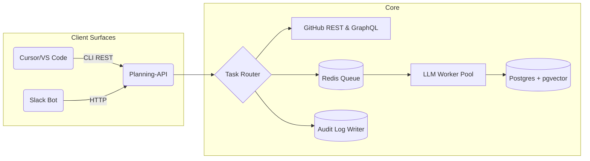

# Autonomy Planning Agent – Product Requirements Document (PRD)

> **Rev. 1.0 – July 15 2025**  
> Owner: Mehul Bhardwaj  
> Status: Draft for Dev Team (phase-scoped)

---

## 0. Purpose & Scope
Create an **AI-augmented planning layer on top of GitHub** that delivers the speed and clarity of Linear while letting humans *and* agents share a single backlog. This document defines goals, hypotheses, phased scope, functional and non-functional requirements, architecture, and release plan.

---

## 1. Problem Statement

*Builders still lose ≈6 h/week to backlog churn, duplicate issues, and context hunting—even after adopting AI code tools.* Existing trackers either add yet another UI (Jira) or stop at painless UX but no cognition (Linear). We need an agent that **keeps the backlog healthy, tells each actor their next best task, and learns local norms—without asking teams to leave GitHub or Slack/IDE.**

---
## 2. Vision 🛰️

> *“A planner that feels like Git, thinks like a senior TPM, and stays invisible until summoned.”*

- **Native** – works through GitHub issues, Tasklists, Projects v2.  
- **Flow-first** – surfaces tasks via CLI/IDE and Slack, extend to a web board later.  
- **Trustable** – every bot edit is auditable, reversible, and explainable.  
- **Adaptive** – learns from reversals and fine-tunes behaviour per team.  
- **Open-core** – OSS foundations, SaaS convenience + enterprise security.

---
## 3. Personas
| Persona | Key Needs | Primary Surfaces |
|---------|-----------|------------------|
| **Developer** | Stay in coding flow; clear next task; minimal process. | VS Code / Cursor palette |
| **Product Manager** | Healthy backlog, visibility, fast clarifications. | Slack threads & digest |
| **Designer** | Quick reviews; no ceremonies. | Slack |
| **Founder/Exec** | Progress & risk snapshots. | Slack digest |

---

## 4. Goals & Objectives

| Goal ID | Category  | Description | KPI Anchor |
| ------- | --------- | ----------- | ---------- |
| G-1 | **Developer Flow** | Reduce coordination overhead for builders by **≥ 30 min / week**. | Mean time-to-next-task ≤ 3 s |
| G-2 | **Backlog Health** | Automatically keep the backlog ≤ 5 % stale/orphaned issues. | Backlog-hygiene score |
| G-3 | **Trust & Transparency** | ≥ 85 % approval of bot edits with reversible audit trail. | Thumbs-up ratio |
| G-4 | **Adoption** | ≥ 70 % weekly active slash-command users in pilot squads. | WAU/MAU |
| G-5 | **Commercial Viability** | 2 paid conversions within 60 days of pilot launch. | Conversion count |

---

## 5. Market Hypotheses
| # | Hypothesis | Validation Metric | Risk if False |
|---|------------|------------------|---------------|
| **H1** | Builders will let an agent pick & update their next task if it saves ≥ 30 min/week. | Flow-interruption survey | Core value weak; pivot required |
| **H2** | Teams trust agent edits when every change is logged & reversible. | Undo usage < 15 % + ≥ 85 % approvals | Ship deeper review gates |
| **H3** | IDE & Chat are preferred surfaces; separate web UI optional. | ≥ 70 % interactions via CLI/Slack | Need dedicated web UI sooner |
| **H4** | Nightly “Backlog Doctor” cuts grooming meeting time ≥ 50 %. | Self-reported time logs | Reduce grooming features |
| **H5** | GitHub-native hierarchy beats building a fresh SaaS tracker. | Tasklists stability + user feedback | Build proprietary board |

*Failure of any critical hypothesis blocks progression to later phases.*

---

## 6. Licensing & Distribution Strategy

| Layer                                             | License                               | Rationale                                                      |
| ------------------------------------------------- | ------------------------------------- | -------------------------------------------------------------- |
| *Core Planning API, CLI, Slack Bot*               | GPLv3                                   | Fosters contributions, mirrors Git open-source ethos.          |
| *Agent Orchestration, LLM Prompts, Pattern Miner* | Server Side Public License (SSPL) | Open code, restricts SaaS copycats.                            |
| *Cloud SaaS*                                      | Proprietary                           | Adds value: autoscaling LLMs, analytics, audit streaming, SSO. |

*Follows Git (GPL2) + GitHub (proprietary SaaS) playbook.*

---

## 7. Success Metrics (v1 targets)

| KPI                                       | Target                  | How Measured         |
| ----------------------------------------- | ----------------------- | -------------------- |
| Mean time-to-next-task (`/autonomy next`) | ≤ 3 s (p95)             | CLI telemetry        |
| Grooming meeting time                     | -50 % within 2 sprints  | Self-reported survey |
| Bot-edit approval (thumbs-up)             | ≥ 85 %                  | Slack modal          |
| Weekly active slash-command users         | ≥ 70 % of pilot         | Analytics service    |
| Two paid conversions                      | within 60 days of pilot | Commercial ops       |

---

## 8. Phased Roadmap & Scope

### Phase 0 – Foundations (Weeks 0-2)
**Deliverables**
- Repo bootstrap & monorepo CI  
- Secret vault & PAT scopes  
- CLI scaffold (`autonomy auth`, `whoami`)

**Definition of Done:** CLI authenticates and returns GitHub username. Authenticates Slack. 

---

### Phase 1 – MVP Beta (Weeks 3-6) ⚑ *Pilot*
**Features**
1. `/autonomy next` & `/autonomy update` (CLI + Slack). Scoring algorithm to be determined in Phase 2. Find mechanism to write down latest ticket score (in queue).
- `/autonomy next [--me]` – returns highest-priority unblocked issue assigned to caller.  
- `/autonomy update <issue> --done --notes "…"` – closes issue, rolls over incomplete subtasks. 
Definition of Done: CLI able to edit issues, return next issue

2. Issue hierarchy auto-maintenance via Tasklists
- Maintain **Epic → Feature → Task → Sub-task** using GitHub Tasklists.  
- Auto-create parent epics if missing; warn if orphan tasks > 3.
Definition of Done: Issue metadata is captured cleanly and maintained over time. System is aware of existing tickets and works with them.

3. Nightly Backlog Doctor digest  
- Flag stale (> 14 days idle), duplicate (≥ 0.9 title/body sim.), or over-large (> 10 checklist items) issues.  
- Post digest to `#autonomy-daily` thread.
Definition of Done: System proactively manages issue hygiene and removes drift.

4. Shadow-branch PR + one-click Undo  
- All multi-issue edits land as PR on branch `autonomy/backlog-patch-<ts>`.  
- Comment embeds JSON diff hash.  
- **Undo** via `/autonomy undo <hash>` (CLI/Slack) within *N* commits window (configurable, default 5). Native integration with Github's version control system as much as possible. 
- Undo reapplies inverse JSON patch to all touched artefacts.
Definition of Done: Supports an ability to version control automated issue updates, using native Github capabilities.

5. Basic metrics (time-to-task, approvals, WAU, LOCs per Assignee)
Definition of Done: System is able to generate automated reports on a daily basis to communication channel (Slack).

6. Security & Permissions
- MVP: PAT limited to `repo`, `issues:write`, `audit_log:read`.  
Definition of Done: System is able to manage user access reliably. Leverage Github's native systems for MVP.

**Hypotheses tested:** H1, H2, H3, H4, H5  
**Pilot cohort:** 10 squads, 2 sprints.

**Tech Stack**
Python + FastAPI monolith for speed.
TypeScript CLI & Slack (share GraphQL queries).
---

### Phase 2 – Learning & Adaptation (Month 2)
1. Reversal feedback modal & pattern miner to learn from Reversals
- Slack undo modal captures `reason`, `severity`, `flow_area`.  
- Pattern miner clusters reasons nightly; if same motif ≥ 3× → propose rule.
Definition of Done: System takes in user-feedback whenever user overrides system's automated work. Is able to learn patterns for that repo, and stick with it in the future.
2. Determine task priority algorithm based on global context and feedback from humans and task asignees (AI agents or Humans).
3. Gather inputs from assignees (summarised logs during task execution, final completion comments). 
3. Team-level rule suggestion engine
4. Assign tasks to relevant Agents, AI tools and Human Reviewers. Enforce the Generate-Verify loop.
5. Pilot analytics dashboard  

*Goal: raise bot-edit approval ≥ 90 % via learned rules.*
**Tech Stack** Extract Go gateway once webhook volume > 1 req/s per repo.
---

### Phase 3 – Production Hardening (Months 3-4)
- SSO/SAML, SCIM, IP allow-lists  
- GitHub Audit Stream → customer SIEM  
- Secret & code-scanning gates on bot PRs  
- 99.9 % uptime SLO (HA Redis + Postgres)
- Production: GitHub Audit Log Streaming → customer SIEM, SSO/SAML, SCIM, ip-allow-lists.

**Tech Stack** 
Add Go job scheduler for Backlog Doctor and audit streaming.
Keep Python strictly for AI/ML
---

### Phase 4 – Context & Insights (Month 5)
- RAG over code, docs, PR history  
- Velocity forecasting & risk heat-maps  
- Multi-repo epic support (Projects v2 stitching)

**Tech Stack** 
Next.js web lens shares TS domain models with CLI.
---

### Phase 5 – Ecosystem & SDK (Month 6+)
- Plugin SDK for custom scorers, alt-LLMs  
- Marketing/Ops intake templates + ambiguity resolver  
- Optional React “Planner Lens” web UI

---

## 9. Functional Requirements (Phase-aligned)

### F-0 (Core)
| ID | Function | Detail |
|----|----------|--------|
| F-0-1 | Secure PAT storage | Vault-backed, env-agnostic |
| F-0-2 | CLI Auth | OAuth device-flow handshake |

### F-1 (MVP Beta)
| ID | Function | Detail |
|----|----------|--------|
| F-1-1 | **Task Retrieval** | `autonomy next` returns highest-priority unblocked issue + AC. Task priority assigned to each issue, evaluated nightly and through human review |
| F-1-2 | **Status Update** | `autonomy update <id> --done --notes` rolls subtasks |
| F-1-3 | **Hierarchy Sync** | Auto-maintain Epic → Task → Sub-task (Tasklists API) |
| F-1-4 | **Backlog Doctor** | Nightly cron flags stale/dup/oversized, posts digest. Look at concept similarity in title + description |
| F-1-5 | **Undo** | Shadow-branch PR, JSON diff hash, `/autonomy undo` |
| F-1-6 | **Instrumentation** | Track latency, approvals, undo rate, WAU |

### F-2 (Learning)
| ID | Function | Detail |
|----|----------|--------|
| F-2-1 | Undo Feedback | Slack modal captures reason, severity, flow_area |
| F-2-2 | Pattern Miner | Cluster feedback, auto-suggest team rules |

### F-3 (Secure GA)
| ID | Function | Detail |
|----|----------|--------|
| F-3-1 | Identity Mgmt | SSO, SAML, SCIM provisioning |
| F-3-2 | Audit Streaming | Forward to customer SIEM |
| F-3-3 | Policy Gates | Secret & code-scan checks on bot PRs |

*(F-4 / F-5 functions align to roadmap items.)*

---

## 10. Non-Functional Requirements (Phase 3 onwards)
| Aspect | Requirement |
|--------|-------------|
| **Performance** | Internal API < 300 ms; CLI round-trip p95 ≤ 3 s |
| **Scalability** | 1 k issues/day, 50 repos/org at MVP |
| **Reliability** | 99.5 % MVP → 99.9 % GA |
| **Compliance** | SOC 2 Type I by GA (GitHub audit for MVP) |
| **Observability** | Centralised logs, metrics, traces |

---

## 11. System Architecture (High-level)

