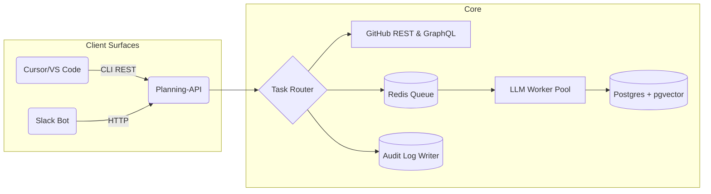

# Autonomy Planning Agent – Product Requirements Document (PRD)

> **Rev. 1.0 – July 15 2025**  
> Owner: Mehul Bhardwaj  
> Status: Draft for Dev Team (phase-scoped)

---

## 0. Purpose & Scope
Create an **AI-augmented planning layer on GitHub** that gives Linear-grade speed while letting humans *and* agents share a single backlog. Each requirement below states the **Why, How-to, and Done-when** so engineers see the business value, the API hint, and the success bar.

---

## 1. Problem Statement

Developers still burn ≈ 6 h/week on coordination even with LLM coding tools. No planner today combines **GitHub-native trust** with **adaptive AI**. Autonomy will fill that gap.

---
## 2. Vision 🛰️

> *"A planner that feels like Git, thinks like a senior TPM, and stays invisible until summoned."*

- **Native** – works through GitHub issues, Tasklists, Projects v2.  
- **Flow-first** – surfaces tasks via CLI/IDE and Slack, extend to a web board later.  
- **Trustable** – every bot edit is auditable, reversible, and explainable.  
- **Adaptive** – learns from reversals and fine-tunes behaviour per team.  
- **Open-source** – OSS foundations with community-driven development.

---
## 3. Personas
| Persona | Key Needs | Primary Surfaces |
|---------|-----------|------------------|
| **Developer** | Stay in coding flow; clear next task; minimal process. | VS Code / Cursor palette |
| **Product Manager** | Healthy backlog, visibility, fast clarifications. | Slack threads & digest |
| **Designer** | Quick reviews; no ceremonies. | Slack |
| **Founder/Exec** | Progress & risk snapshots. | Slack digest |

---

## 4. Goals & Objectives

| Goal ID | Category  | Description | KPI Anchor |
| ------- | --------- | ----------- | ---------- |
| G-1 | **Developer Flow** | Reduce coordination overhead for builders by **≥ 30 min / week**. | Mean time-to-next-task ≤ 3 s |
| G-2 | **Backlog Health** | Automatically keep the backlog ≤ 5 % stale/orphaned issues. | Backlog-hygiene score |
| G-3 | **Trust & Transparency** | ≥ 85 % approval of bot edits with reversible audit trail. | Thumbs-up ratio |
| G-4 | **Adoption** | ≥ 70 % weekly active slash-command users in pilot squads. | WAU/MAU |

---

## 5. Market Hypotheses
| # | Hypothesis | Validation Metric | Risk if False |
|---|------------|------------------|---------------|
| **H1** | Builders will let an agent pick & update their next task if it saves ≥ 30 min/week. | Flow-interruption survey | Core value weak; pivot required |
| **H2** | Teams trust agent edits when every change is logged & reversible. | Undo usage < 15 % + ≥ 85 % approvals | Ship deeper review gates |
| **H3** | IDE & Chat are preferred surfaces; separate web UI optional. | ≥ 70 % interactions via CLI/Slack | Need dedicated web UI sooner |
| **H4** | Nightly "Backlog Doctor" cuts grooming meeting time ≥ 50 %. | Self-reported time logs | Reduce grooming features |
| **H5** | GitHub-native hierarchy beats building a fresh project tracker. | Tasklists stability + user feedback | Build proprietary board |
| **H6** | A multi-queue ranking engine improves planned-vs-done ratio by ≥ 20 %.                                                      | Δ sprint completion % across two sprints                            | Ranking adds no measurable value           |
| **H7** | Persistent overrides cut undo calls by ≥ 50 % vs. stateless overrides.                                                      | Undo events / 100 agent edits                                       | Override UX misunderstood                  |
| **H8** | A simple Pin / Unpin toggle covers ≥ 90 % of "freeze this" use-cases and reduces manual drags by ≥ 30 %.                     | Drag events per sprint; pin usage rate                              | Need richer lock mechanism                 |
| **H9** | A Reversal-Rule Engine can learn 70 % of recurring overrides and auto-apply them within two sprints.                        | % recurring overrides converted to auto-rules                       | Manual work remains high                   |

*Failure of any critical hypothesis blocks progression to later phases.*

---

## 6. Licensing & Distribution Strategy

| Layer                                             | License                               | Rationale                                                      |
| ------------------------------------------------- | ------------------------------------- | -------------------------------------------------------------- |
| *Core Planning API, CLI, Slack Bot*               | GPLv3                                   | Fosters contributions, mirrors Git open-source ethos.          |
| *Agent Orchestration, LLM Prompts, Pattern Miner* | Server Side Public License (SSPL) | Open code, restricts SaaS copycats.                            |
| *Community Features*                              | Open Source                           | Adds value: community contributions, extensions, integrations. |

*Follows open source community-driven development model.*

---

## 7. Success Metrics (v1 targets)

| KPI                                       | Target                  | How Measured         |
| ----------------------------------------- | ----------------------- | -------------------- |
| Mean time-to-next-task (`/autonomy next`) | ≤ 3 s (p95)             | CLI telemetry        |
| Grooming meeting time                     | -50 % within 2 sprints  | Self-reported survey |
| Bot-edit approval (thumbs-up)             | ≥ 85 %                  | Slack modal          |
| Weekly active slash-command users         | ≥ 70 % of pilot         | Analytics service    |
| Two active contributors                   | within 60 days of pilot | Community metrics    |

---

## 8. Phased Roadmap & Scope

### Phase 0 – Foundations (Weeks 0-2)

| Deliverable | **Why** | **How-to** | **Done-when** |
|-------------|---------|------------|---------------|
| **Instant CLI bootstrap** (`pipx install autonomy`) | Cut first-run friction to < 60 s | Use GitHub **Device-Flow OAuth** (POST to `/login/device/code`) | User runs `autonomy init` and lands on authenticated shell in one command |
| Repo & CI | Quality gates | GitHub Actions with pytest, black, mypy | All PRs auto-test with >80% coverage |
| Secret vault | Token safety | OS keychain (macOS Keychain, Windows Credential Manager) + file fallback | No secrets in git, encrypted storage |
| **Board bootstrap** | Consistent metadata | GraphQL `createProjectV2Field` for Priority, Pinned, Track, Sprint | Fields exist & IDs cached in `~/.autonomy/field_cache.json` |
| **Slack Bot setup** | Team communication | Slack App OAuth + webhook endpoint | `/autonomy help` works in Slack channels | 

---

### Phase 1 – MVP Beta (Weeks 3-6) ⚑ *Pilot*
**Features**
1. `/autonomy next` & `/autonomy update` (CLI + Slack). Basic priority ranking system using GitHub Projects v2 fields and position index.
- `/autonomy next [--me]` – returns highest-priority unblocked issue assigned to caller.  
- `/autonomy update <issue> --done --notes "…"` – closes issue, rolls over incomplete subtasks. 
- Priority ranking based on: Priority field (P0-P3), Sprint proximity, issue age, blocked status.
- Manual override support: "Pinned" field allows users to freeze issue position from automatic reordering.
- Slack slash commands: `/autonomy next`, `/autonomy update <issue>`, `/autonomy status`
Definition of Done: CLI able to edit issues, return next issue with transparent priority reasoning. Slack commands work in channels.

2. Issue hierarchy auto-maintenance via Tasklists
- Maintain **Epic → Feature → Task → Sub-task** using GitHub Tasklists.  
- Auto-create parent epics if missing; warn if orphan tasks > 3.
Definition of Done: Issue metadata is captured cleanly and maintained over time. System is aware of existing tickets and works with them.

3. Nightly Backlog Doctor digest  
- Flag stale (> 14 days idle), duplicate (≥ 0.9 title/body sim.), or over-large (> 10 checklist items) issues.  
- Post digest to `#autonomy-daily` Slack thread with actionable recommendations.
Definition of Done: System proactively manages issue hygiene and removes drift. Slack digest posted nightly.

4. Shadow-branch PR + one-click Undo  
- All multi-issue edits land as PR on branch `autonomy/backlog-patch-<ts>`.  
- Comment embeds JSON diff hash.  
- **Undo** via `/autonomy undo <hash>` (CLI/Slack) within *N* commits window (configurable, default 5). Native integration with Github's version control system as much as possible. 
- Undo reapplies inverse JSON patch to all touched artefacts.
Definition of Done: Supports an ability to version control automated issue updates, using native Github capabilities.

5. Basic metrics (time-to-task, approvals, WAU, LOCs per Assignee)
Definition of Done: System is able to generate automated reports on a daily basis to Slack communication channel with clear metrics dashboards.

6. Security & Permissions
- MVP: PAT limited to `repo`, `issues:write`, `audit_log:read`.  
Definition of Done: System is able to manage user access reliably. Leverage Github's native systems for MVP.

**Hypotheses tested:** H1, H2, H3, H4, H5  
**Pilot cohort:** 10 squads, 2 sprints.

**Tech Stack**
Python + FastAPI monolith for speed.
TypeScript CLI & Slack (share GraphQL queries).
---

### Phase 2 – Core Enhancement (Month 2)
1. Enhanced ranking engine with basic learning
- Improve priority algorithm based on team feedback
- Multi-queue Ranking Engine (team & actor views)
- Overrides ledger + Pin/Unpin Boolean field (auto-created by bootstrap)      
2. Basic analytics and metrics
- Track pin usage, override frequency, planned/done delta
- Simple dashboard for team insights
3. Enhanced undo system
- Basic undo feedback collection
- Improved audit trail

*Goal: improve team productivity and transparency.*
**Tech Stack** Keep Python for simplicity and maintainability.
---

### Phase 3 – Core Stability (Months 3-4)
- Enhanced security and reliability
- Improved error handling and recovery
- Better performance optimization
- Community monitoring and feedback collection

**Tech Stack** 
Keep Python for simplicity and maintainability.
---

### Phase 4 – Core Insights (Month 5)
- Basic code-aware planning
- Simple velocity tracking
- Enhanced team insights
- Improved documentation and examples

**Tech Stack** 
Keep Python for simplicity and maintainability.
---

### Phase 5 – Core Ecosystem (Month 6+)
- Simple extension points for customizations
- Enhanced documentation and examples
- Community-driven improvements

---

## 9. Functional Requirements (Phase-aligned)

### F-0 (Core)
| ID | Function | Detail |
|----|----------|--------|
| F-0-1 | Instant CLI bootstrap | `pipx install autonomy` → `autonomy init` → authenticated shell in <60s |
| F-0-2 | Device-Flow OAuth | GitHub Device-Flow OAuth (POST to `/login/device/code`) for seamless authentication |
| F-0-3 | OS-native secret storage | OS keychain (macOS Keychain, Windows Credential Manager) + file fallback |
| F-0-4 | Board Bootstrap | `autonomy board init` creates Priority, Pinned, Sprint, Track fields; caches field IDs in `~/.autonomy/field_cache.json` |
| F-0-5 | Slack Bot Setup | Slack App creation, OAuth flow, basic webhook infrastructure, workspace authentication |

### F-1 (MVP Beta)
| ID | Function | Detail |
|----|----------|--------|
| F-1-1 | Task Retrieval | `autonomy next` returns highest-priority unblocked issue with transparent ranking. Priority score based on: Priority field (P0-P3), Sprint proximity, issue age, blocked status. Manual "Pinned" field prevents automatic reordering |
| F-1-2 | Status Update | `autonomy update <id> --done --notes` rolls subtasks |
| F-1-3 | Hierarchy Sync | Auto-maintain Epic → Task → Sub-task (Tasklists API) |
| F-1-4 | Backlog Doctor | Nightly cron flags stale/dup/oversized, posts digest. Look at concept similarity in title + description |
| F-1-5 | Undo | Shadow-branch PR, JSON diff hash, `/autonomy undo` |
| F-1-6 | Slack Commands | `/autonomy next`, `/autonomy update <id>`, `/autonomy status` slash commands with GitHub integration |
| F-1-7 | Slack Notifications | Nightly backlog doctor digest, metrics reports, undo confirmations posted to channels |
| F-1-8 | Instrumentation | Track latency, approvals, undo rate, WAU |

### F-2 (Core Enhancement)
| ID | Function | Detail |
|----|----------|--------|
| F-2-1  | Overrides Listener          | Webhook captures drag/field edits; writes to `overrides` table |
| F-2-2  | Ranking Engine              | Weighted score; skips `pin=true`; reorders via `updateProjectV2ItemPosition` |
| F-2-3  | Pin/Unpin Toggle            | `Pinned` single-select field; `/autonomy pin|unpin <id>` |

### F-3 (Core Security)
| ID | Function | Detail |
|----|----------|--------|
| F-3-1 | Identity Mgmt | GitHub OAuth, community authentication |

*(F-4 / F-5 functions align to roadmap items.)*

---

## 10. Non-Functional Requirements (Core)
| Aspect | Requirement |
|--------|-------------|
| **Performance** | Internal API < 300 ms; CLI round-trip p95 ≤ 3 s |
| **Scalability** | 1 k issues/day, 50 repos/org at MVP |
| **Reliability** | 99.5 % MVP → 99.9 % GA |
| **Security** | GitHub audit for MVP |
| **Observability** | Basic logs, metrics, traces |

---

## 11. Core vs Pro Features

This PRD covers the open source core features. For advanced features including:

- **Advanced AI Learning**: Reversal-Rule Engine, Pattern Miner, Multi-Agent Orchestration
- **Enterprise Features**: SSO/SAML, SCIM, IP allow-lists, Audit streaming
- **SaaS Features**: Hosted deployment, Premium support, Multi-repo support
- **Advanced Analytics**: RAG integration, Velocity forecasting, Risk heat-maps
- **Web UI**: React "Planner Lens" interface

Advanced features are planned for future releases.

---

## 12. System Architecture (High-level)

